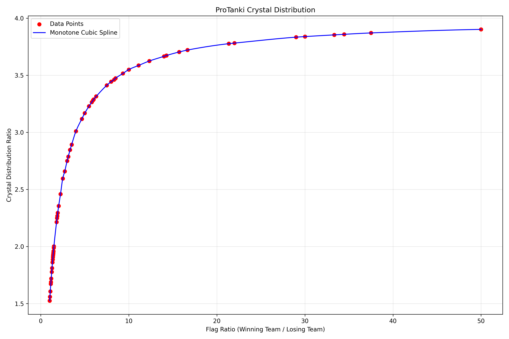

# ProTankiCrystalPrediction

An intelligent real-time prediction tool that analyzes ProTanki match data to predict crystal rewards using computer vision and machine learning.

## Overview

This program uses screen capture, OCR (Optical Character Recognition), and statistical modeling to predict how many crystals (in-game currency) you'll receive after a ProTanki match. The prediction is based on analyzing the correlation between player scores, battle fund, and team performance metrics.

### How It Works

The system finds a correlation between player score and battle fund, requiring minimal data collection for accurate predictions. The program scans your screen and outputs the expected diamond amount at match completion.

**Data Sources**: Personal gameplay data and community screenshots from the ProTanki Discord server.

## Prerequisites

- **Python**
- **Tesseract OCR** - Download from [UB-Mannheim/tesseract](https://github.com/UB-Mannheim/tesseract/wiki)
- **Windows 10**
- **ProTanki game** running in fullscreen mode

## Installation

1. **Clone the repository**
   ```bash
   git clone https://github.com/Friebay/ProTankiCrystalPrediction.git
   cd ProTankiCrystalPrediction
   ```

2. **Create and activate virtual environment**
   
   **Windows (Command Prompt):**
   ```cmd
   python -m venv protanki_env
   protanki_env\Scripts\activate.bat
   ```

3. **Install dependencies**
   ```bash
   pip install --upgrade pip
   pip install -r requirements.txt
   ```

4. **Verify installation**
   ```bash
   python setup_check.py
   ```
   This script will check all dependencies and required files.

## Usage

1. **Start the background program**
   ```bash
   python run_program.py
   ```
   This will run in the background and handle the data collection.

2. **Start the GUI**
   ```bash
   python run_gui.py
   ```
   This will open the graphical user interface that displays on top of all programs.

3. **Using the program during a ProTanki match**
   - Make sure both programs are running (background and GUI)
   - While in a ProTanki match, **hold the TAB key** to activate the data collection sequence
   - Wait for **3 beep sounds** to confirm the process is complete
   - **Release the TAB key** and check the results on the GUI
   - If some data fields show "N/A", **hold TAB again** until all data fields are properly filled

## Program Demonstration


The GIF above demonstrates the GUI of the program and shows how it works in practice. Users can simply run the program and use the interface to capture and analyze their ProTanki match data to predict crystal rewards.

## Crystal Distribution Analysis



The chart above shows the relationship between the ratio of flags (winning team flags divided by losing team flags) on the x-axis and the crystal distribution between the teams ratio on the y-axis. The red dots represent real data points collected from actual matches, while the blue line shows a monotonic cubic spline estimation that helps predict crystal distribution based on the flag ratio.